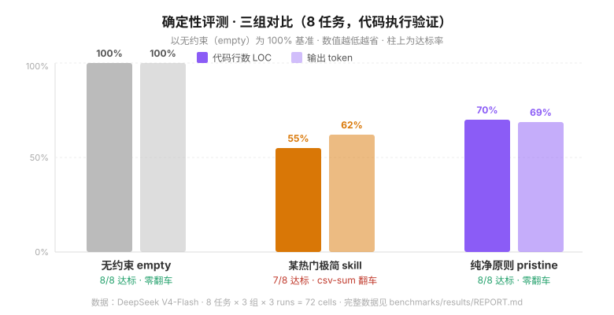

# Pristine — The First-Time Principle


If memory loss is the root, let every AI agent rebirth follow the First-Time Principle.

Perhaps the only agent skill you need — your output, forever written as if for the first time. Pure, clear, economical, objective, adversarial.

Works with Claude Code, OpenAI Codex, OpenCode, OpenClaw, Doubao.

> Current version **v2.2** · See [CHANGELOG](CHANGELOG.md) for updates

[简体中文](README.md) | **English**

---

## What you get

**Fewer tokens burned.** On the same tasks, its output is **78% shorter**. Long sessions close the door by context water level, so you stop paying for facts already evicted. Saving tokens is the side effect; saving *your time* is the point.

**Less rework.** In deterministic evaluation it passes **8/8 tasks, zero failures**: complete without being bloated. Real brevity isn't "so short it's unusable" — it's everything needed and nothing else.

**Less babysitting.** It doesn't blindly accept your premises, doesn't add scope you never asked for, and looks for the strongest counter-argument before concluding. You don't have to hover and pull it back when it drifts.

**Less mess.** No patch piles in the code, no docs silently rotting, and every rule lives in exactly one place. Change one thing — everything follows.

## Evidence, not vibes

Same model, same tasks, three groups: no install / Pristine / a popular minimal skill. The results are visible:



**Example: vague premise** — the user says "the API returns 500, probably the database is slow":

- **No install:** it does question the premise, but pads with SQL examples at every step — low information density
- **"Just be concise":** "add an index, optimize SQL, add cache" — a slogan you can't execute
- **With Pristine:** it questions the premise first, then gives executable steps, then closes with "send me the slow-query log when done":

> First, confirm: a 500 isn't necessarily slow DB. Check the logs for the actual error and slow queries before optimizing.
> 1. Check logs: what kind of 500 (timeout, lock wait, pool exhaustion)
> 2. Check slow queries: `EXPLAIN ANALYZE` for the most expensive SQL
> 3. Check the pool: `SHOW PROCESSLIST` for connection buildup
> 4. Check system metrics: high CPU = heavy queries, high IO = missing index, high memory = check cache
> When done, provide the slow-query log and `SHOW PROCESSLIST`, and I'll give the specific fix.

**Example: implement login** — no install: auto-adds registration + frontend tutorial, hits the token cap, never finishes the core code; "just be concise": compact but stores passwords in plaintext; with Pristine: does the API only, salted PBKDF2 hashing, injection-safe.

> Reproducible: `python3 benchmarks/deter/skillbench-deter.py`; full data & methodology in `benchmarks/results/REPORT.md`.

## Get started in one minute

Just say this to your AI — it installs itself:

```
Help me install this skill: https://github.com/newbanser/pristine-skill
```

Want to try before installing? Paste [`SKILL.md`](SKILL.md) as a prompt — you're in pristine mode immediately.

---

**Dive deeper** (how it works, where it stops) → [The full guide](docs/guide.md)
**Changelog** → [CHANGELOG](CHANGELOG.md)
**Discuss** → [GitHub Discussions](https://github.com/newbanser/pristine-skill/discussions)

---

By [白露 (Bailu)](https://github.com/bailu-agent). MIT License. Star it if it saved you one patch.
